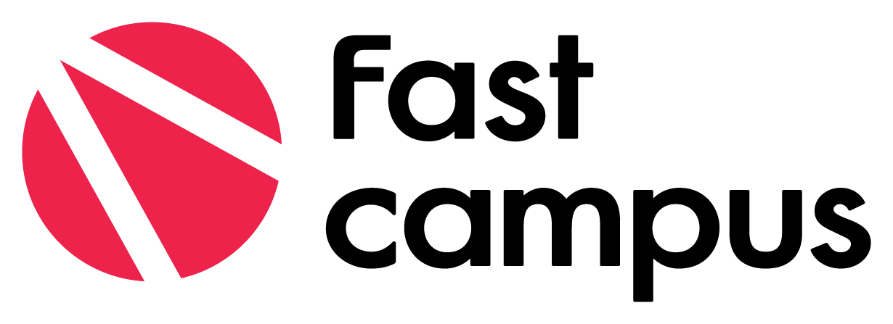

## 패스트 캠퍼스 올인원 패키지 : 딥러닝 / 인공지능
### Since 2020. 06. 17 ~

### 2020. 06. 17 수요일
### DAY01 - 딥러닝 기본 개념 : https://bit.ly/3dmQcKk

### 2020. 06. 19 금요일
### DAY02 - Numpy 연습하기

### 2020. 06. 20 토요일
### DAY03 - Numpy 연습하기 / 데이터 시각화 - 그래프

### 2020. 06. 21 일요일
### DAY04 - 데이터 시각화 - 이미지 / TensorFlow 2.0 기본 사용법
